# Diagramas de flujo del backend

Copiá cada bloque ` ```mermaid ` a [mermaid.live](https://mermaid.live) para verlo o exportarlo (PNG/SVG).  
Complementa: [COMO_FUNCIONA.md](COMO_FUNCIONA.md) · [NEGOCIO.md](NEGOCIO.md) · [MODELOS.md](MODELOS.md) · [SEGURIDAD.md](SEGURIDAD.md) · [TESTING.md](TESTING.md).

### Índice de diagramas

| # | Tema |
|---|------|
| 1–2 | Vista general y capas |
| 3, 10 | Auth y JWT |
| 4–6, 9 | Gasto, transferencia, soft-delete, endpoint |
| 7–8 | Dominio y rutas `/api/v1` |
| 11–15 | Schema, Model, Service, Repository, BD |
| 16 | HTTP vs HTTPS / proxy |
| 17 | Arranque local |
| 18 | Presupuestos |
| 19 | Reports / dashboard |
| 20 | Efectivo / wallet |
| 21 | Admin + MFA |
| 22 | Webhooks HMAC |
| 23 | Pirámide de tests |
| 24 | CI GitHub Actions |

---

## 1. Vista general del sistema

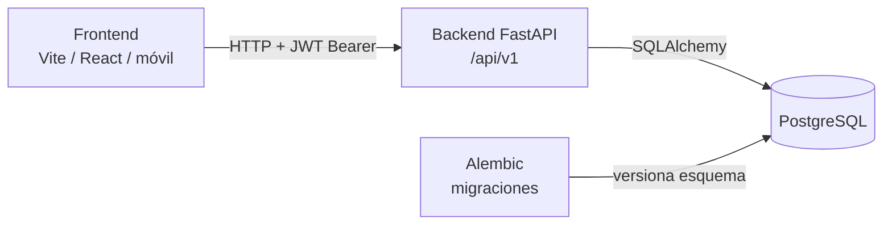

---

## 2. Capas dentro de una petición

Qué pieza toca cada request típica (CRUD autenticado):

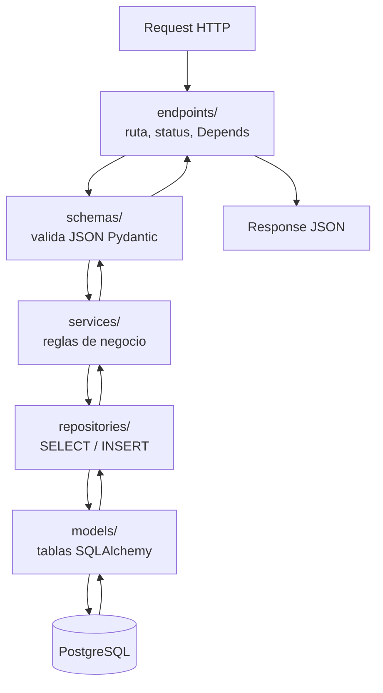

| Carpeta | Rol en una frase |
|---------|------------------|
| `app/api/v1/endpoints/` | Ventanilla HTTP |
| `app/schemas/` | Forma del JSON |
| `app/services/` | ¿Está permitido? ¿Cómo mueve el saldo? |
| `app/repositories/` | Habla con la BD |
| `app/models/` | Columnas y relaciones |
| `app/core/` | JWT, MFA, rate limit, webhooks |
| `alembic/` | Historia del esquema |

---

## 3. Flujo de autenticación

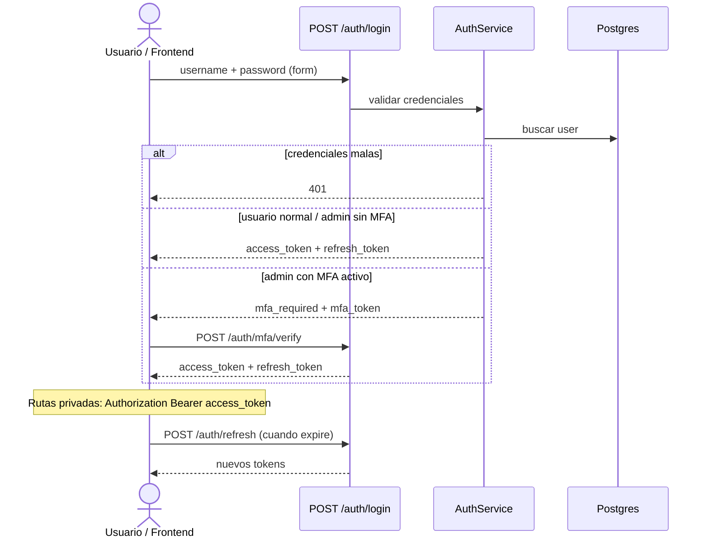

---

## 4. Flujo: crear un gasto / ingreso

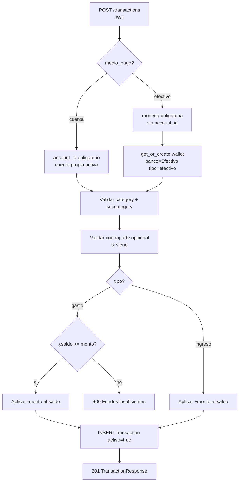

---

## 5. Flujo: transferencia entre cuentas

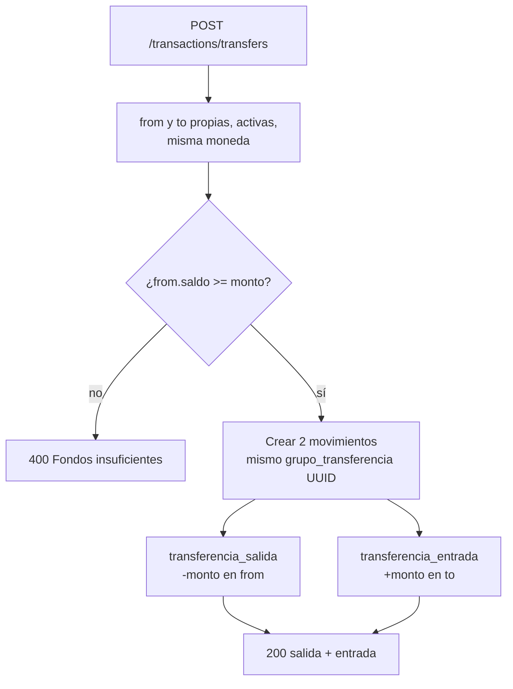

---

## 6. Soft-delete (DELETE = desactivar)

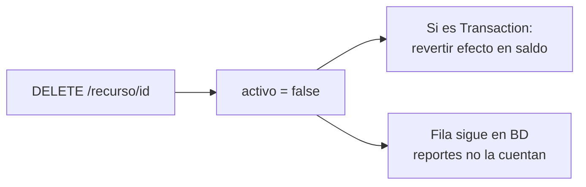

---

## 7. Mapa de dominios (qué hablan entre sí)

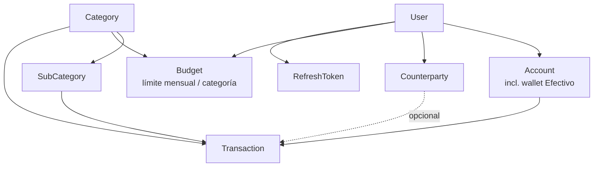

---

## 8. Piezas HTTP montadas (`/api/v1`)

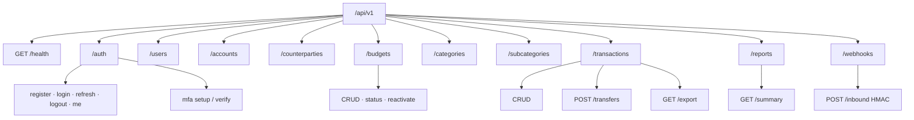

Montaje real: `app/api/v1/router.py`.

---

## 9. Ejemplo real: `POST /api/v1/transactions`

Endpoint de referencia: `create_transaction` en `app/api/v1/endpoints/transaction.py` → `TransactionService.create`.

### 9.1 Secuencia (quién llama a quién)

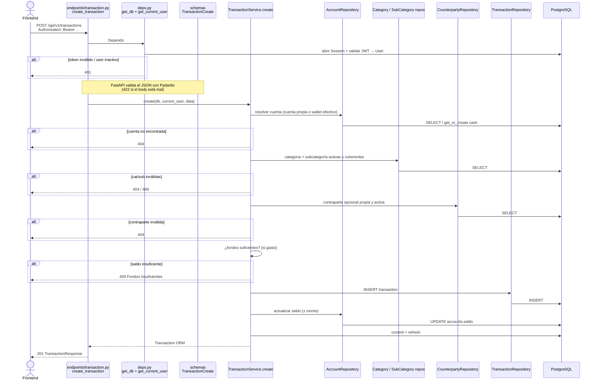

### 9.2 Flujo de decisión dentro del service

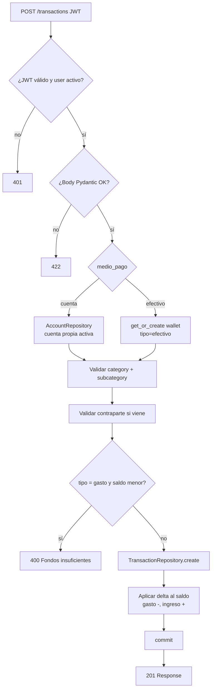

Archivos involucrados:

| Paso | Archivo |
|------|---------|
| Ruta HTTP | `app/api/v1/endpoints/transaction.py` |
| Auth + sesión BD | `app/api/deps.py` |
| Formato JSON | `app/schemas/transaction.py` |
| Reglas | `app/services/transaction.py` |
| Persistencia | `app/repositories/*.py` + `app/models/*.py` |

---

## 10. Cómo funciona JWT en este proyecto

En este backend hay **dos tokens distintos**:

| Token | Tipo | Dónde vive | Vida útil |
|-------|------|------------|-----------|
| **access** | JWT firmado (HS256) | Solo en el cliente (header) | ~30 min (`ACCESS_TOKEN_EXPIRE_MINUTES`) |
| **refresh** | String opaco (no JWT) | Hash en tabla `refresh_tokens` | ~14 días |

Código: `app/core/security.py` · `app/services/auth.py` · `app/api/deps.py`.

### 10.1 Qué lleva por dentro el access JWT

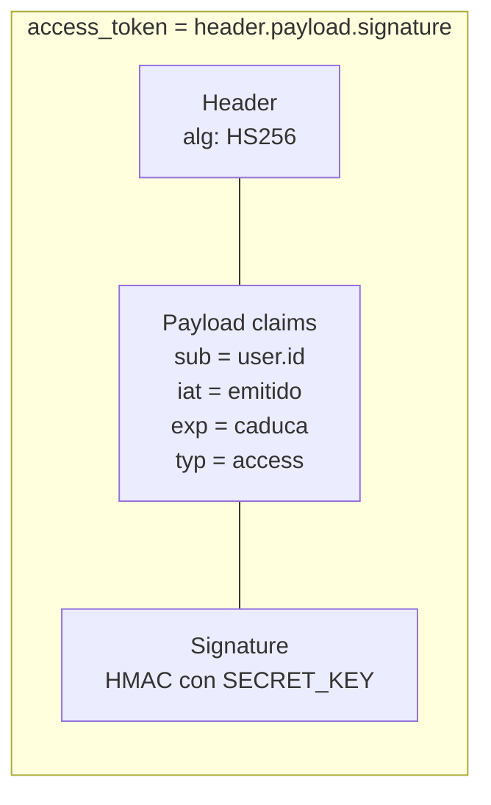

El servidor **no guarda** el access token. Solo lo verifica con `SECRET_KEY`.

### 10.2 Emisión en el login

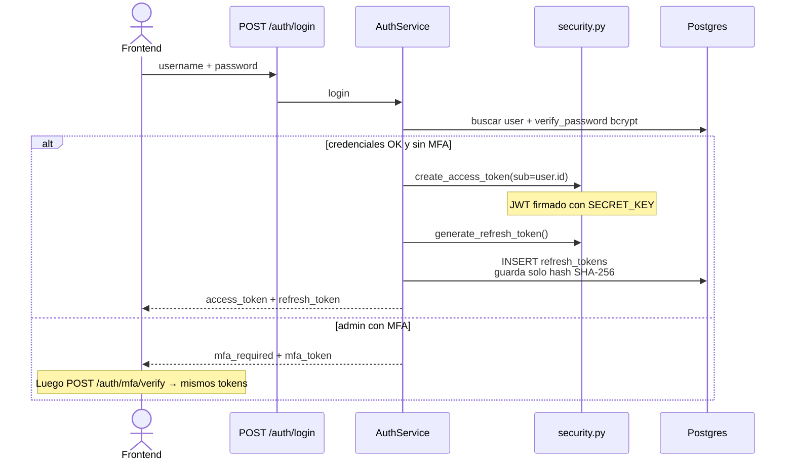

### 10.3 Request protegido (usar el JWT)

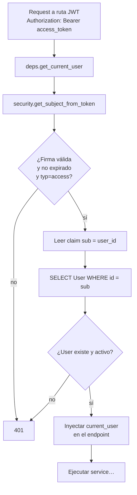

### 10.4 Caducó el access → refresh

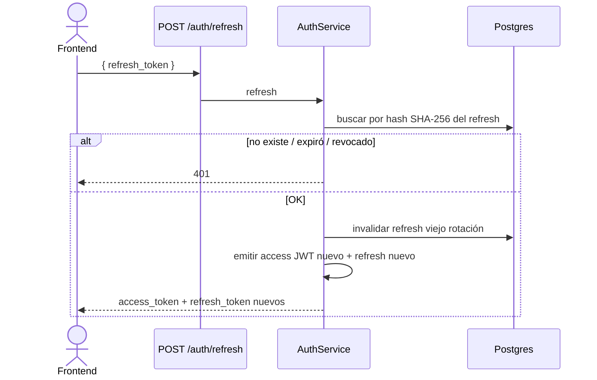

### 10.5 Resumen mental

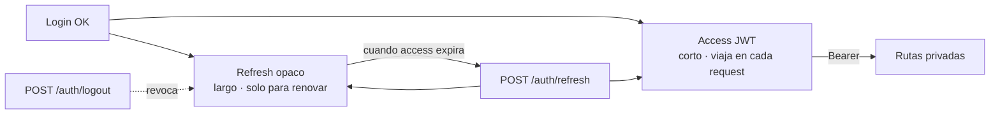

---

## 11. Cómo funciona un Schema (Pydantic)

Un **schema** no es una tabla de Postgres. Es la **plantilla del JSON** que entra o sale por HTTP.

| Concepto | Qué es | Carpeta |
|----------|--------|---------|
| **Schema** | Forma + validación del JSON (Pydantic) | `app/schemas/` |
| **Model** | Tabla ORM / filas en BD | `app/models/` |
| **Endpoint** | Une ambos (`data: TransactionCreate`, `response_model=…`) | `app/api/.../endpoints/` |

Ejemplo real: `app/schemas/transaction.py`.

### 11.1 Dónde actúa en la petición

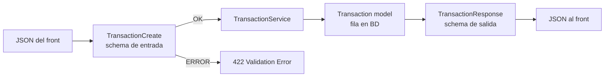

### 11.2 Familia típica por recurso

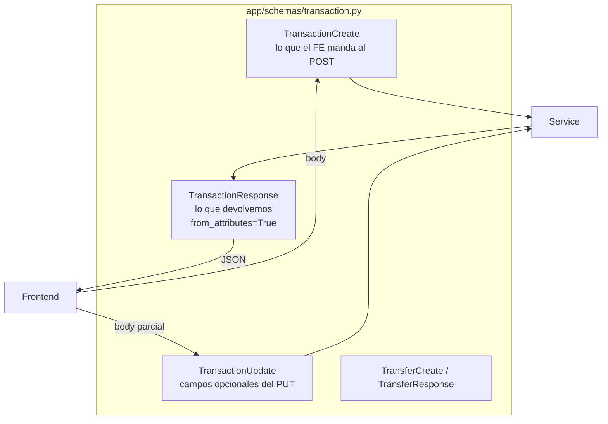

### 11.3 Qué valida `TransactionCreate` (paso a paso)

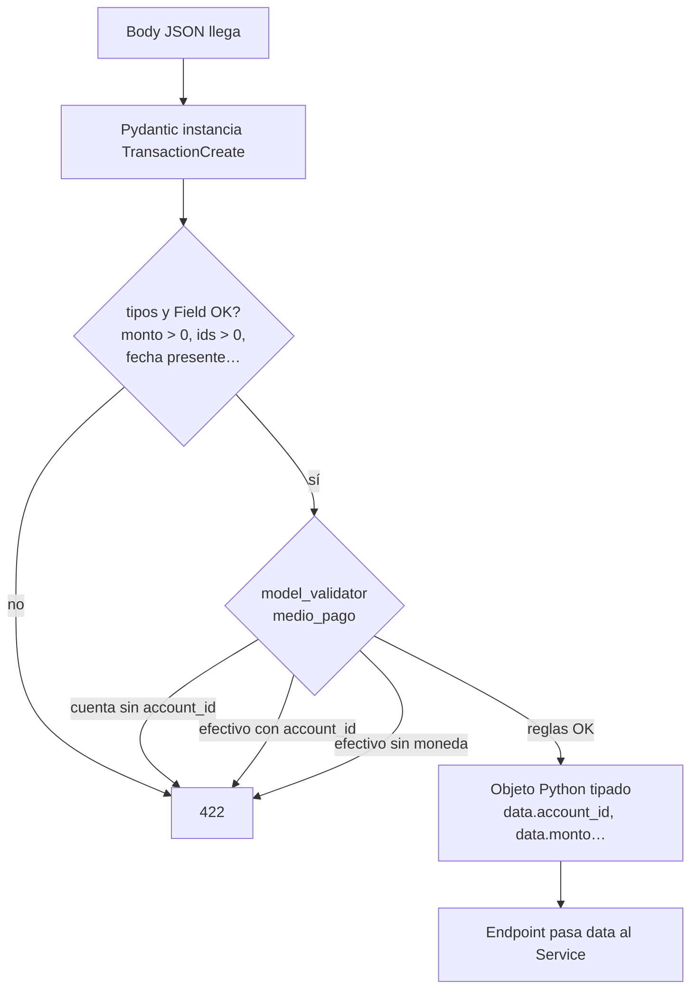

Campos clave del create:

```text
account_id?   category_id   sub_category_id
monto > 0     tipo: gasto|ingreso
medio_pago: cuenta|efectivo
moneda?       contraparte_id?   fecha   descripcion
```

### 11.4 Entrada vs salida (por qué hay dos clases)

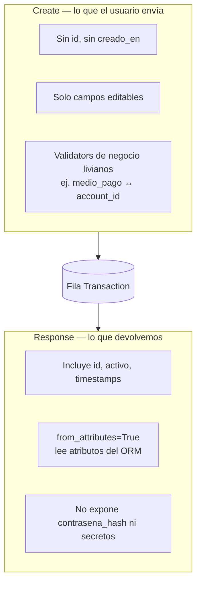

### 11.5 Mental model en una frase

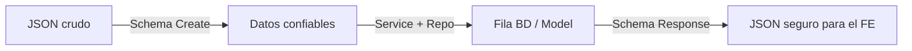

Schemas = **portero del JSON**. Models = **filas de la BD**. No son lo mismo.

---

## 12. Cómo funciona un Model (SQLAlchemy)

Un **model** es la clase Python que representa **una tabla** de Postgres.  
No valida el JSON del front (eso es el schema); describe columnas, FK y relaciones.

| Concepto | Qué es | Ejemplo |
|----------|--------|---------|
| **Model** | Clase ORM ↔ tabla | `Transaction` → `transactions` |
| **Schema** | Contrato JSON HTTP | `TransactionCreate` |
| **Alembic** | Historial de cambios del esquema SQL | `alembic/versions/…` |

Ejemplo real: `app/models/transaction.py`.

### 12.1 Model ↔ tabla

```mermaid
flowchart LR
  Py["class Transaction(Base)<br/>app/models/transaction.py"] -->|mapea| Tab[("tabla transactions<br/>en PostgreSQL")]
  Py -->|registrado en| Meta[Base.metadata]
  Meta -->|usa Alembic| Mig[Migraciones]
```

### 12.2 Anatomía de un model

```mermaid
flowchart TB
  subgraph Tx["Transaction"]
    PK[id PK autoincrement]
    FK1[account_id → accounts]
    FK2[category_id → categories]
    FK3[sub_category_id → sub_categories]
    FK4[contraparte_id → counterparties<br/>nullable]
    Cols[monto · tipo · medio_pago<br/>fecha · descripcion · activo<br/>grupo_transferencia]
    Aud[creado_en · actualizado_en]
    Rel[relationship:<br/>account, category,<br/>sub_category, counterparty]
  end

  PK --- FK1 --- FK2 --- FK3 --- FK4 --- Cols --- Aud --- Rel
```

### 12.3 Dónde aparece en el flujo

```mermaid
flowchart LR
  EP[Endpoint] --> SCH[Schema Create]
  SCH --> SVC[Service]
  SVC --> REPO[Repository]
  REPO --> MOD[Model Transaction<br/>objeto en memoria]
  MOD -->|INSERT/UPDATE/SELECT| DB[(PostgreSQL)]
  MOD --> RESP[Schema Response<br/>from_attributes]
  RESP --> FE[JSON al front]
```

### 12.4 Relación Model vs Schema (misma entidad)

```mermaid
flowchart TB
  subgraph no_confundir["No son lo mismo"]
    M["Model Transaction<br/>• columnas SQL<br/>• FK / relationship<br/>• vive con la BD"]
    S["Schema TransactionCreate/Response<br/>• campos JSON<br/>• Field / validators<br/>• vive en el HTTP"]
  end

  S -->|Service arma o lee| M
  M -->|Response.model_validate| S
```

### 12.5 Ciclo de vida de una fila vía Model

```mermaid
flowchart TD
  A[Service crea Transaction...] --> B[Repository.create<br/>db.add + flush]
  B --> C[(INSERT en transactions)]
  C --> D[Más tarde: SELECT → objeto Model]
  D --> E{activo?}
  E -->|true| F[Aparece en listados / reportes]
  E -->|false soft-delete| G[Fila sigue en BD<br/>pero no se usa en lógica activa]
  D --> H[Response lee atributos del Model]
```

### 12.6 Mental model en una frase

```mermaid
flowchart LR
  A[Model] -->|es el| B[mapa Python ↔ fila SQL]
  C[Schema] -->|es el| D[mapa JSON ↔ request/response]
  E[Alembic] -->|versiona| F[cambios de columnas/tablas]
```

Heredan de `Base` (`app/db/base.py`). Sin eso, Alembic no “ve” la tabla.

---

## 13. Cómo funciona un Service

Un **service** es donde vive la **lógica de negocio**: permisos, saldos, validaciones de producto.  
No parsea JSON (schema) ni escribe SQL a mano (repository).

| Capa | Decide | Ejemplo |
|------|--------|---------|
| **Endpoint** | Ruta HTTP + Depends | `create_transaction(...)` |
| **Service** | ¿Se puede? ¿Qué efecto tiene? | `TransactionService.create` |
| **Repository** | Leer/escribir filas | `TransactionRepository.create` |

Ejemplo real: `app/services/transaction.py`.

### 13.1 Lugar en la arquitectura

```mermaid
flowchart TB
  EP[Endpoint<br/>delgado] --> SVC[Service<br/>reglas de negocio]
  SVC --> REPO1[AccountRepository]
  SVC --> REPO2[CategoryRepository]
  SVC --> REPO3[TransactionRepository]
  REPO1 --> DB[(Postgres)]
  REPO2 --> DB
  REPO3 --> DB
  SVC -->|devuelve Model| EP
  EP -->|response_model Schema| FE[Frontend]
```

### 13.2 Responsabilidades típicas

```mermaid
flowchart LR
  subgraph Service["TransactionService"]
    O[Ownership<br/>¿es mío?]
    R[Reglas<br/>fondos, medio_pago,<br/>cat/sub coherentes]
    E[Efectos<br/>± saldo, soft-delete,<br/>pares de transferencia]
    C[Orquestar repos<br/>+ commit]
  end

  O --> R --> E --> C
```

### 13.3 Flujo concreto: `TransactionService.create`

```mermaid
flowchart TD
  A[Endpoint llama<br/>TransactionService.create] --> B[_resolve_account_for_medio<br/>cuenta propia o wallet efectivo]
  B --> C[_ensure_category_pair]
  C --> D[_ensure_own_active_counterparty]
  D --> E[_ensure_sufficient_funds<br/>si es gasto]
  E -->|falla| Err[HTTPException 400/404]
  E -->|OK| F[Arma objeto Transaction]
  F --> G[TransactionRepository.create]
  G --> H[_apply_saldo ± monto]
  H --> I[AccountRepository.update]
  I --> J[db.commit + refresh]
  J --> K[return Transaction model]
```

### 13.4 Qué hace y qué no hace

```mermaid
flowchart TB
  subgraph SI["Sí — Service"]
    S1[Validar ownership]
    S2[Rechazar fondos insuficientes]
    S3[Crear wallet efectivo si hace falta]
    S4[Actualizar saldo según tipo]
    S5[Soft-delete + revertir impacto]
  end

  subgraph NO["No — otras capas"]
    N1[Parsear JSON → Schema]
    N2[Definir columnas SQL → Model]
    N3[Armar SELECT genérico → Repository]
    N4[Elegir status HTTP de ruta → Endpoint]
  end
```

### 13.5 Service vs Repository

```mermaid
sequenceDiagram
  participant EP as Endpoint
  participant SVC as Service
  participant REPO as Repository
  participant DB as Postgres

  EP->>SVC: create(db, user, data)
  Note over SVC: Aquí están las reglas
  SVC->>REPO: get_by_id_for_user(...)
  REPO->>DB: SELECT
  DB-->>REPO: fila / None
  REPO-->>SVC: Account | None
  alt no es mío / inactivo
    SVC-->>EP: HTTPException 404
  else OK
    SVC->>REPO: create(item)
    REPO->>DB: INSERT
    SVC->>DB: commit
    SVC-->>EP: Model
  end
```

### 13.6 Mental model en una frase

```mermaid
flowchart LR
  A[Schema] -->|datos válidos| B[Service]
  B -->|órdenes de negocio| C[Repository]
  C -->|SQL| D[(BD)]
  B -->|HTTPException| E[400 / 403 / 404]
```

**Service = el cocinero** (decide la receta). Repository = abrir la nevera. Endpoint = la ventanilla.

---

## 14. Cómo funciona un Repository

Un **repository** es la capa que **habla con la BD** vía SQLAlchemy: `SELECT`, `add`, `flush`.  
No conoce HTTP, JWT ni Pydantic. Solo `Session` + models.

| Capa | Rol |
|------|-----|
| **Service** | Reglas + `commit` |
| **Repository** | Queries / persistencia + `flush` |
| **Model** | Forma de la fila |

Ejemplo real: `app/repositories/transaction.py` · guía: [REPOSITORIOS.md](REPOSITORIOS.md).

### 14.1 Lugar en la arquitectura

```mermaid
flowchart LR
  SVC[Service] --> REPO[Repository]
  REPO --> MOD[Model]
  MOD --> DB[(PostgreSQL)]
  REPO -->|devuelve Model / lista / None| SVC
```

### 14.2 Convención de este proyecto

```mermaid
flowchart TB
  subgraph Repo["Repository"]
    R1[db.add / cambios en objetos]
    R2[db.flush — obtiene id sin cerrar transacción]
  end

  subgraph Svc["Service"]
    S1[Orquesta varios repos]
    S2[db.commit — confirma todo]
    S3[db.refresh — recarga timestamps]
  end

  Repo --> Svc
```

Así un gasto puede hacer **INSERT transaction + UPDATE saldo** en **un solo commit**.

### 14.3 Métodos típicos

```mermaid
flowchart TB
  subgraph TXR["TransactionRepository"]
    G1[get_by_id]
    G2[get_by_id_for_user<br/>ownership via join a Account]
    L[list_filtered<br/>filtros + limit/offset + total]
    C[create → add + flush]
    U[update → flush]
    P[list_by_transfer_group<br/>piernas de transferencia]
  end
```

### 14.4 Flujo concreto: crear un movimiento

```mermaid
sequenceDiagram
  participant SVC as TransactionService
  participant AccR as AccountRepository
  participant TxR as TransactionRepository
  participant DB as Postgres

  SVC->>AccR: get_by_id_for_user / get_or_create cash
  AccR->>DB: SELECT …
  AccR-->>SVC: Account

  Note over SVC: Validaciones de negocio

  SVC->>TxR: create(db, Transaction(...))
  TxR->>DB: INSERT + flush
  TxR-->>SVC: item con id

  SVC->>AccR: update saldo
  AccR->>DB: flush cambios
  SVC->>DB: commit
```

### 14.5 Qué hace y qué no hace

```mermaid
flowchart TB
  subgraph SI["Sí — Repository"]
    A[Armar select / where / join]
    B[Filtrar only_active]
    C[add + flush]
    D[Devolver Model o None]
  end

  subgraph NO["No — otras capas"]
    E[¿Fondos suficientes? → Service]
    F[Validar JSON → Schema]
    G[status 401/404 de ruta → Endpoint]
    H[db.commit salvo casos raros → Service]
  end
```

### 14.6 Ownership: el patrón `*_for_user`

```mermaid
flowchart TD
  A[get_by_id_for_user] --> B[JOIN / filtro user_id]
  B --> C{¿Existe y es del user?}
  C -->|sí| D[return Model]
  C -->|no| E[return None]
  E --> F[Service convierte None → 404]
```

El repository **no lanza** HTTPException; el service interpreta `None`.

### 14.7 Mental model en una frase

```mermaid
flowchart LR
  A[Service pide] -->|encontrar / guardar| B[Repository]
  B -->|SQLAlchemy| C[(BD)]
  B -->|Model en memoria| A
```

**Repository = abrir la nevera** (traer o guardar ingredientes).  
**Service = cocinar** (decidir qué se puede hacer con ellos).

---

## 15. Cómo funciona la base de datos

En este proyecto **Postgres solo guarda datos**. No sabe de JWT ni de “gasto vs ingreso”.  
La forma de las tablas la define el **backend** (models + Alembic).

| Pieza | Rol |
|-------|-----|
| **Docker `db`** | Contenedor Postgres + volumen (persistencia) |
| **Alembic** | Crea/altera tablas (`alembic upgrade head`) |
| **SQLAlchemy engine/session** | Conexiones desde la API |
| **Models** | Mapa Python ↔ tablas |
| **Repositories** | SQL vía ORM |
| **Seed SQL** | Datos demo (`scripts/data/demo_100_users.sql`) |

Detalle de columnas: [MODELOS.md](MODELOS.md). Head Alembic actual: `a7b8c9d0e1f2`.

### 15.1 Vista física

```mermaid
flowchart LR
  API[Backend FastAPI<br/>en tu PC / servidor]
  PG[(PostgreSQL<br/>container db)]
  VOL[Volumen Docker<br/>datos en disco]
  ALE[Alembic<br/>./scripts/migrate.sh]

  API -->|DATABASE_URL<br/>SQLAlchemy| PG
  ALE -->|CREATE/ALTER TABLE| PG
  PG --> VOL
```

`docker compose up db -d` levanta el motor **vacío**. Las tablas aparecen al migrar.

### 15.2 Tablas del dominio (mapa)

```mermaid
erDiagram
  users ||--o{ accounts : tiene
  users ||--o{ counterparties : tiene
  users ||--o{ budgets : tiene
  users ||--o{ refresh_tokens : tiene
  accounts ||--o{ transactions : mueve
  categories ||--o{ sub_categories : contiene
  categories ||--o{ transactions : clasifica
  categories ||--o{ budgets : limita
  sub_categories ||--o{ transactions : clasifica
  counterparties ||--o| transactions : opcional

  users {
    int id PK
    string correo
    string usuario
    string contrasena_hash
    string rol
    bool activo
  }
  accounts {
    int id PK
    int user_id FK
    string banco
    string tipo
    string moneda
    decimal saldo
    bool activo
  }
  transactions {
    int id PK
    int account_id FK
    int category_id FK
    int sub_category_id FK
    int contraparte_id FK
    decimal monto
    string tipo
    string medio_pago
    bool activo
  }
  budgets {
    int id PK
    int user_id FK
    int category_id FK
    decimal limite
    bool activo
  }
```

También hay `categories`, `sub_categories`, `counterparties`, `refresh_tokens`.

### 15.3 Ciclo de una sesión por request

```mermaid
sequenceDiagram
  participant EP as Endpoint
  participant Dep as get_db deps.py
  participant Eng as engine / SessionLocal
  participant PG as PostgreSQL

  EP->>Dep: Depends(get_db)
  Dep->>Eng: SessionLocal()
  Eng->>PG: abrir conexión del pool
  Dep-->>EP: db Session
  Note over EP: Service + Repository usan db
  EP->>PG: SELECT / INSERT / UPDATE
  Note over EP: Service hace commit si todo OK
  EP->>Dep: fin del request
  Dep->>Eng: db.close()
```

Archivo: `app/db/session.py` (`pool_pre_ping=True`, `autocommit=False`).

### 15.4 Quién crea el esquema

```mermaid
flowchart TD
  M[Escribes app/models/Foo.py] --> I[Import en models/__init__.py]
  I --> R[alembic revision --autogenerate]
  R --> V[Archivo en alembic/versions/]
  V --> U[alembic upgrade head<br/>o ./scripts/migrate.sh]
  U --> T[(Tablas/columnas en Postgres)]
```

La API **no** hace `create_all` en producción: el contrato es Alembic.

### 15.5 Reglas contables en la BD (efecto, no magia)

```mermaid
flowchart LR
  subgraph BD["Lo que la BD guarda"]
    Acc[accounts.saldo]
    Tx[transactions filas]
  end

  subgraph App["Lo que la API decide"]
    Svc[TransactionService]
  end

  Svc -->|INSERT transaction| Tx
  Svc -->|UPDATE saldo ± monto| Acc
  Svc -->|DELETE HTTP = activo=false<br/>+ revertir saldo| Tx
  Svc -->|UPDATE| Acc
```

Postgres **no** recalcula saldos solo: lo hace el service en la misma transacción SQLAlchemy (`commit` único).

### 15.6 Datos demo

```mermaid
flowchart LR
  Mig[migrate → tablas vacías] --> Seed[psql -f demo_100_users.sql]
  Seed --> Users[demo001…demo100]
  Users --> Accs[cuentas + efectivo]
  Accs --> Movs[movimientos 2026]
```

### 15.7 Mental model en una frase

```mermaid
flowchart LR
  A[Postgres] -->|es| B[almacén de filas]
  C[Alembic] -->|define| D[forma de las tablas]
  E[Models + Repos] -->|leen y escriben| A
  F[Services] -->|reglas sobre esos datos| E
```

**BD = nevera.** Alembic = planos de estantes. API = quién cocina con lo guardado.

---

## 16. HTTP vs HTTPS (reverse proxy)

La API uvicorn habla **HTTP interno**. En producción el **proxy** termina TLS.

```mermaid
flowchart LR
  U[Usuario / Frontend] -->|HTTPS :443<br/>certificado TLS| P[Reverse proxy<br/>Caddy / Nginx / Traefik / ALB]
  P -->|HTTP :8000<br/>X-Forwarded-Proto=https| API[FastAPI / uvicorn]
  API --> PG[(Postgres)]
```

### Producción con `FORCE_HTTPS`

```mermaid
flowchart TD
  R[Request llega a FastAPI] --> A{APP_ENV=production<br/>y FORCE_HTTPS?}
  A -->|no| OK[Continúa normal<br/>local HTTP OK]
  A -->|sí| B{X-Forwarded-Proto<br/>== https?}
  B -->|no| E400[400 HTTPS required]
  B -->|sí| C[Procesa request]
  C --> D[Respuesta + header HSTS]
```

Local: `http://localhost:8000` + `FORCE_HTTPS=false`.  
Prod: proxy HTTPS + `FORCE_HTTPS=true` + `APP_ENV=production`. Ver [SEGURIDAD.md](SEGURIDAD.md).

---

## 17. Arranque local (día 1)

```mermaid
flowchart TD
  A[Clonar repo + .venv + pip install] --> B[cp .env.example .env]
  B --> C[docker compose up db -d]
  C --> D[./scripts/migrate.sh<br/>alembic upgrade head]
  D --> E{¿Querés datos demo?}
  E -->|sí| F[psql … -f scripts/data/demo_100_users.sql]
  E -->|no| G[uvicorn app.main:app --reload]
  F --> G
  G --> H[API en :8000<br/>/docs si DEBUG=true]
  H --> I[Login demo001 / Password123!]
```

```mermaid
flowchart LR
  subgraph host["Tu PC"]
    UV[uvicorn FastAPI]
    SCR[scripts migrate / seed]
  end
  subgraph docker["Docker"]
    DB[(Postgres + volumen)]
  end
  UV --> DB
  SCR --> DB
```

---

## 18. Presupuestos (`/budgets`)

Límite **mensual** único por `(user, category)`. Migración `a7b8c9d0e1f2`.

```mermaid
flowchart TD
  A[POST /budgets<br/>category_id + limite] --> B{¿Ya existe<br/>budget esa categoría?}
  B -->|activo| E409[409 conflicto]
  B -->|inactivo| C[Reactivar + actualizar límite]
  B -->|no| D[INSERT budgets]
  C --> OK[Budget]
  D --> OK
```

### Consumo del mes

```mermaid
flowchart LR
  B[Budget activo] --> S[BudgetService.to_status / list_status]
  S --> G[Sumar gastos activos<br/>de esa category<br/>en mes calendario]
  G --> ST[BudgetStatus:<br/>gastado, restante,<br/>pct_usado, excedido]
  ST --> R[También en<br/>GET /reports/summary<br/>→ budgets_status]
```

CRUD: `GET/POST/PUT/DELETE /budgets` + `GET /budgets/status` + reactivate.

---

## 19. Reports / dashboard (`GET /reports/summary`)

```mermaid
flowchart TD
  A[GET /reports/summary<br/>JWT + filtros opcionales] --> B[ReportService.summary]
  B --> C[Solo transactions activo=true]
  C --> D[Totals operativos<br/>ingresos / gastos / neto]
  C --> E[Transferencias aparte]
  C --> F[by_category / by_subcategory]
  C --> G[by_medio_pago]
  C --> H[by_counterparty top 10]
  C --> I[by_month / by_account]
  B --> J[period_comparison<br/>ventana actual vs anterior]
  B --> K[BudgetService.list_status]
  D --> Z[ReportSummary JSON]
  E --> Z
  F --> Z
  G --> Z
  H --> Z
  I --> Z
  J --> Z
  K --> Z
```

Filtros: `date_from`, `date_to`, `account_id`.  
Las transferencias **no** inflan gastos/ingresos del día a día.

---

## 20. Efectivo / wallet automático

```mermaid
flowchart TD
  A[POST /transactions<br/>medio_pago=efectivo] --> B[moneda obligatoria<br/>sin account_id]
  B --> C[AccountRepository.get_or_create_cash_wallet]
  C --> D{¿Existe account<br/>user + moneda<br/>tipo=efectivo?}
  D -->|sí| E[Usar esa cuenta]
  D -->|no| F[Crear<br/>banco=Efectivo<br/>tipo=efectivo]
  E --> G[INSERT transaction<br/>account_id = wallet]
  F --> G
  G --> H[± saldo del wallet]
```

```mermaid
flowchart LR
  Banco[Cuenta banco<br/>tipo ahorro/corriente] <-->|POST /transfers| Cash[Wallet Efectivo<br/>tipo=efectivo]
```

`POST /accounts` con `tipo=efectivo` a mano → **400** (solo auto).

---

## 21. Admin + MFA TOTP

```mermaid
sequenceDiagram
  actor A as Admin
  participant L as POST /auth/login
  participant M as POST /auth/mfa/verify
  participant API as Rutas admin catálogo

  A->>L: usuario + password
  alt password OK y mfa_enabled
    L-->>A: mfa_required + mfa_token<br/>(sin access/refresh aún)
    A->>M: mfa_token + código TOTP app
    M-->>A: access_token + refresh_token
  else user normal
    L-->>A: tokens directo
  end
  A->>API: Bearer access + rol=admin + MFA activo
  Note over API: get_current_admin exige ambos
```

Setup MFA (alta del secreto TOTP) vive en endpoints/auth MFA enable; el login admin **siempre** pasa por el challenge si `mfa_enabled=true`.

---

## 22. Webhooks HMAC (`POST /webhooks/inbound`)

No usa JWT. Valida integridad del body. **No** llama URLs del payload (anti-SSRF).

```mermaid
flowchart TD
  Ext[Sistema externo] --> Sig["Firma:<br/>t=timestamp,v1=HMAC_SHA256<br/>de ts. + raw_body"]
  Sig --> EP[POST /webhooks/inbound<br/>header X-Webhook-Signature]
  EP --> V{verify_signature}
  V -->|sin WEBHOOK_SECRET| E503[503]
  V -->|mala / vieja >300s| E401[401]
  V -->|OK| P[Validar JSON Pydantic]
  P --> R[202 received<br/>procesar evento interno]
```

```mermaid
flowchart LR
  Body[raw body bytes] --> Msg["ts. + body"]
  Msg --> H[HMAC-SHA256<br/>WEBHOOK_SECRET]
  H --> Header[t=…,v1=hex]
```

---

## 23. Pirámide de tests

```mermaid
flowchart TB
  subgraph muchos["Muchos — baratos"]
    U[unit<br/>services / repos / core<br/>SQLite en memoria]
  end
  subgraph algunos["Algunos"]
    I[integration<br/>TestClient API<br/>marker integration]
  end
  subgraph pocos["Pocos — caros"]
    P[postgres<br/>RUN_INTEGRATION=1]
    E[e2e<br/>servidor vivo RUN_E2E=1]
  end
  U --> I --> P
  I --> E
```

```bash
pytest -m "not e2e and not postgres"   # día a día
pytest -m postgres                      # con Postgres real
```

Ver [TESTING.md](TESTING.md).

---

## 24. CI (GitHub Actions)

Workflow: `.github/workflows/ci.yml`  
Triggers: push a `main`/`dev`/`dev_*` y PRs a `main`/`dev`.

```mermaid
flowchart TD
  A[push / pull_request] --> B[Checkout + Python 3.12]
  B --> C[pip install requirements-dev]
  C --> D[Ruff lint]
  C --> E[pip-audit]
  C --> F[Servicio Postgres 16]
  F --> G[alembic upgrade head]
  G --> H["pytest not e2e and not postgres<br/>+ coverage ≥ 70%"]
  G --> I[pytest -m postgres<br/>RUN_INTEGRATION=1]
  D --> J{OK?}
  E --> J
  H --> J
  I --> J
  J -->|sí| Green[CI verde]
  J -->|no| Red[CI rojo · bloquea merge]
```

---

## Cómo usar estos diagramas

1. Abrí [https://mermaid.live](https://mermaid.live)
2. Pegá solo el contenido entre ` ```mermaid ` y ` ``` `
3. Exportá PNG/SVG si lo necesitás para Notion/Figma/slides
4. En **diagrams.net**: *Arrange → Insert → Advanced → Mermaid* también acepta sintaxis similar
