# Backend flow diagrams

Copy each ` ```mermaid ` block to [mermaid.live](https://mermaid.live) to view or export it (PNG/SVG).  
Complements: [HOW_IT_WORKS.md](HOW_IT_WORKS.md) · [BUSINESS.md](BUSINESS.md) · [MODELS.md](MODELS.md) · [SECURITY.md](SECURITY.md) · [TESTING.md](TESTING.md).

### Diagram index

| # | Topic |
|---|------|
| 1–2 | Overview and layers |
| 3, 10 | Auth and JWT |
| 4–6, 9 | Expense, transfer, soft-delete, endpoint |
| 7–8 | Domain and `/api/v1` routes |
| 11–15 | Schema, Model, Service, Repository, DB |
| 16 | HTTP vs HTTPS / proxy |
| 17 | Local startup |
| 18 | Budgets |
| 19 | Reports / dashboard |
| 20 | Cash / wallet |
| 21 | Admin + MFA |
| 22 | HMAC webhooks |
| 23 | Test pyramid |
| 24 | CI GitHub Actions |

---

## 1. System overview

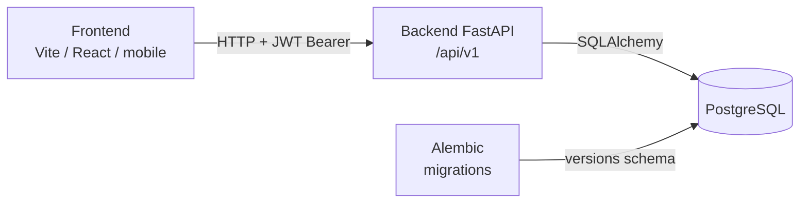

---

## 2. Layers within a request

Which piece each typical request touches (authenticated CRUD):

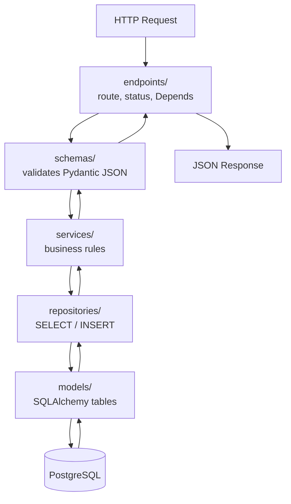

| Folder | Role in one sentence |
|---------|------------------|
| `app/api/v1/endpoints/` | HTTP service window |
| `app/schemas/` | JSON shape |
| `app/services/` | Is it allowed? How does it move the balance? |
| `app/repositories/` | Talks to the DB |
| `app/models/` | Columns and relationships |
| `app/core/` | JWT, MFA, rate limit, webhooks |
| `alembic/` | Schema history |

---

## 3. Authentication flow

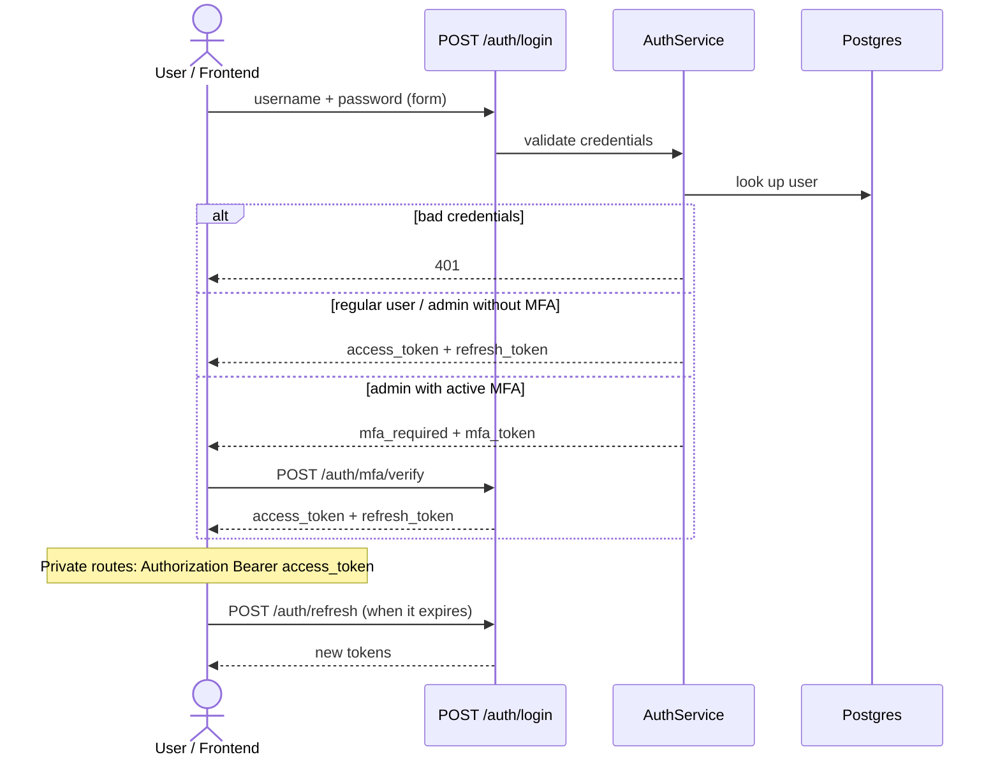

---

## 4. Flow: create an expense / income

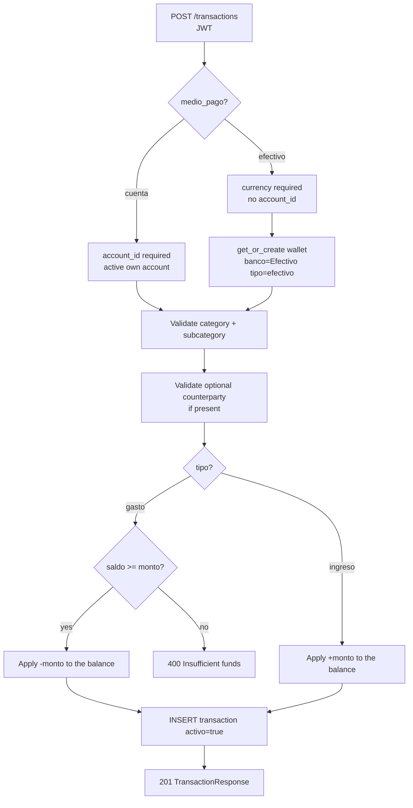

---

## 5. Flow: transfer between accounts

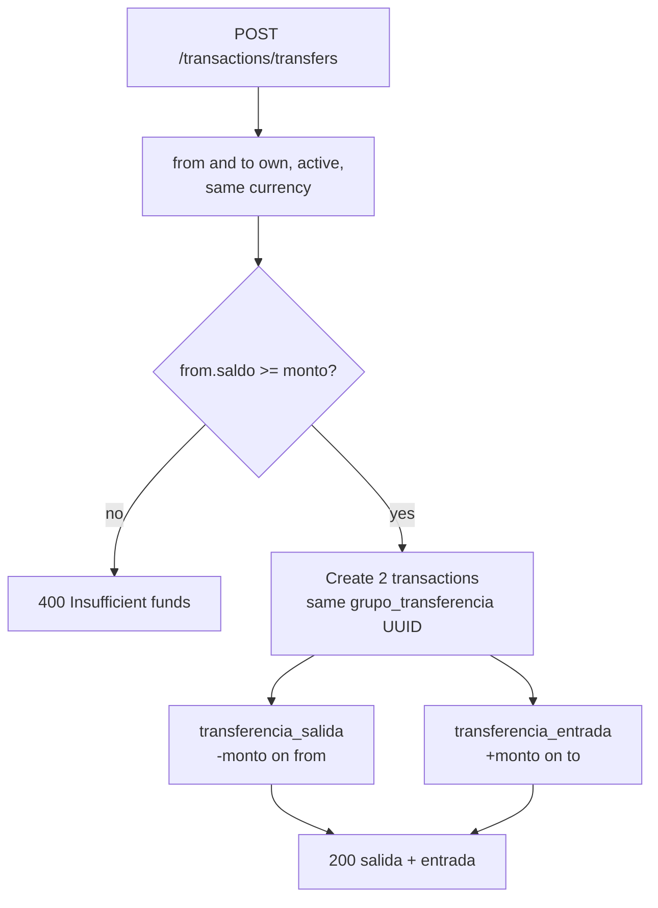

---

## 6. Soft-delete (DELETE = deactivate)

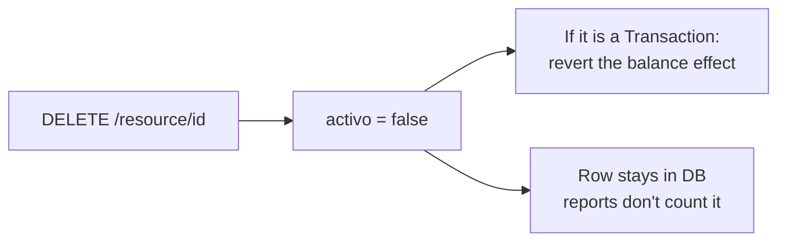

---

## 7. Domain map (what talks to what)

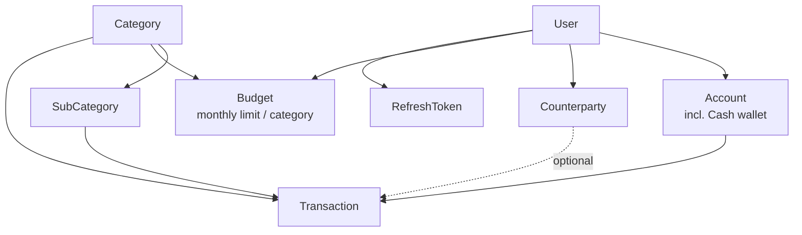

---

## 8. Mounted HTTP pieces (`/api/v1`)

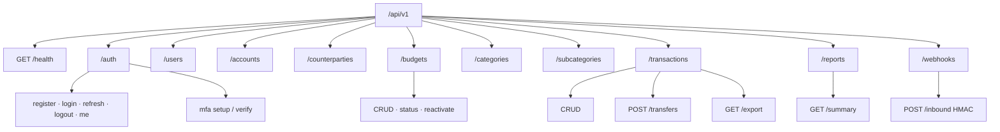

Real mounting: `app/api/v1/router.py`.

---

## 9. Real example: `POST /api/v1/transactions`

Reference endpoint: `create_transaction` in `app/api/v1/endpoints/transaction.py` → `TransactionService.create`.

### 9.1 Sequence (who calls whom)

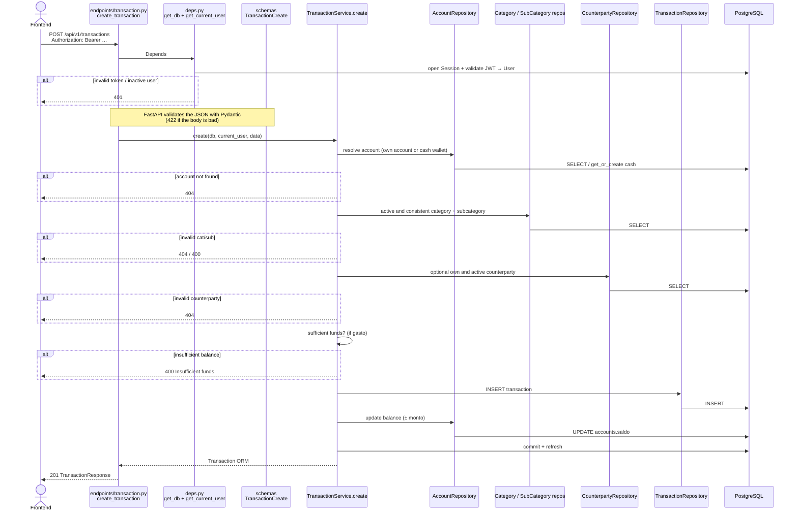

### 9.2 Decision flow within the service

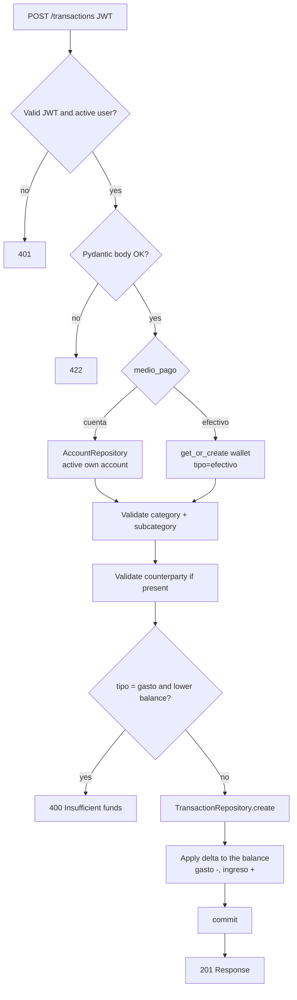

Files involved:

| Step | File |
|------|---------|
| HTTP route | `app/api/v1/endpoints/transaction.py` |
| Auth + DB session | `app/api/deps.py` |
| JSON format | `app/schemas/transaction.py` |
| Rules | `app/services/transaction.py` |
| Persistence | `app/repositories/*.py` + `app/models/*.py` |

---

## 10. How JWT works in this project

In this backend there are **two different tokens**:

| Token | Type | Where it lives | Lifetime |
|-------|------|------------|-----------|
| **access** | Signed JWT (HS256) | Only on the client (header) | ~30 min (`ACCESS_TOKEN_EXPIRE_MINUTES`) |
| **refresh** | Opaque string (not JWT) | Hash in the `refresh_tokens` table | ~14 days |

Code: `app/core/security.py` · `app/services/auth.py` · `app/api/deps.py`.

### 10.1 What the access JWT carries inside

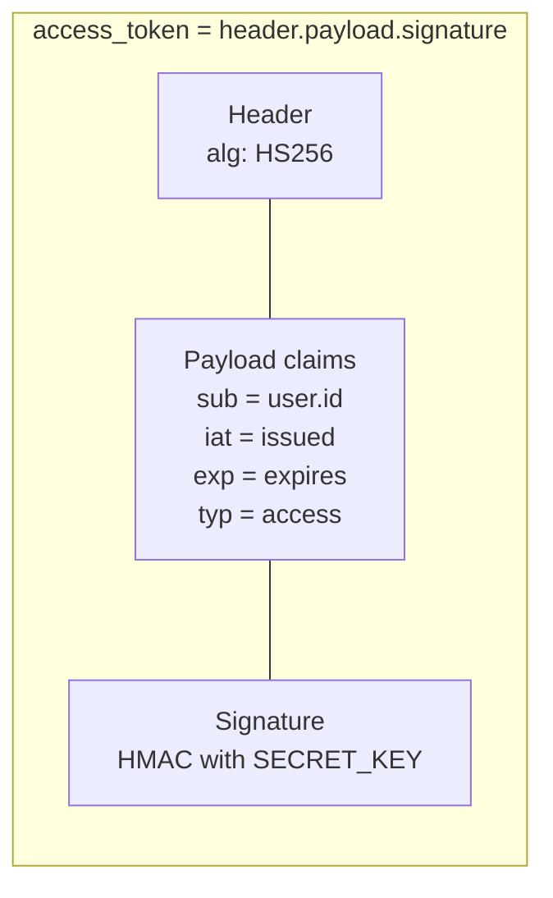

The server **does not store** the access token. It only verifies it with `SECRET_KEY`.

### 10.2 Issuance at login

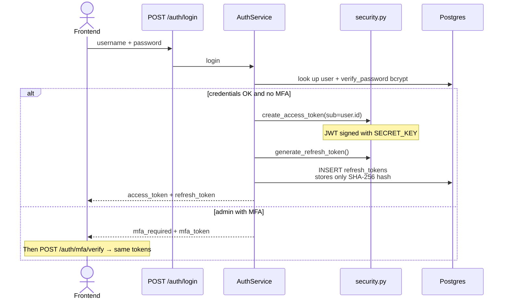

### 10.3 Protected request (using the JWT)

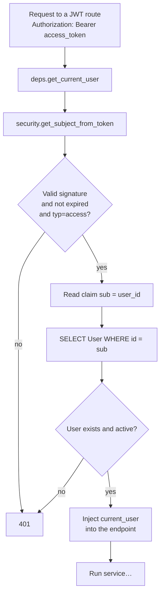

### 10.4 Access expired → refresh

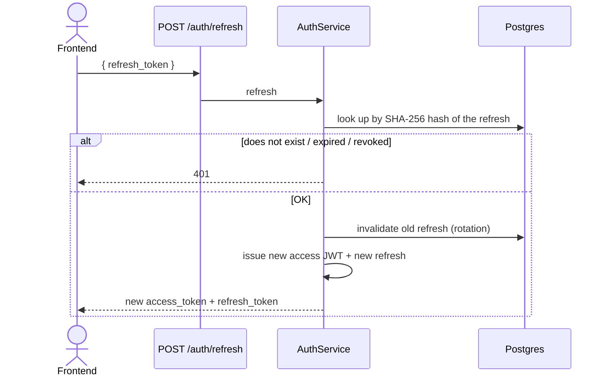

### 10.5 Mental summary

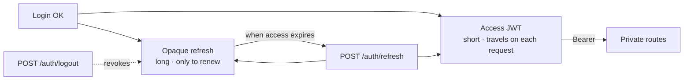

---

## 11. How a Schema works (Pydantic)

A **schema** is not a Postgres table. It is the **template of the JSON** that comes in or goes out over HTTP.

| Concept | What it is | Folder |
|----------|--------|---------|
| **Schema** | JSON shape + validation (Pydantic) | `app/schemas/` |
| **Model** | ORM table / rows in the DB | `app/models/` |
| **Endpoint** | Joins both (`data: TransactionCreate`, `response_model=…`) | `app/api/.../endpoints/` |

Real example: `app/schemas/transaction.py`.

### 11.1 Where it acts in the request

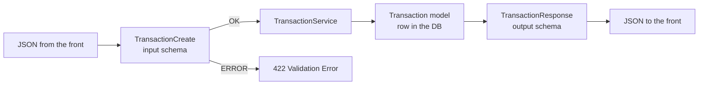

### 11.2 Typical family per resource

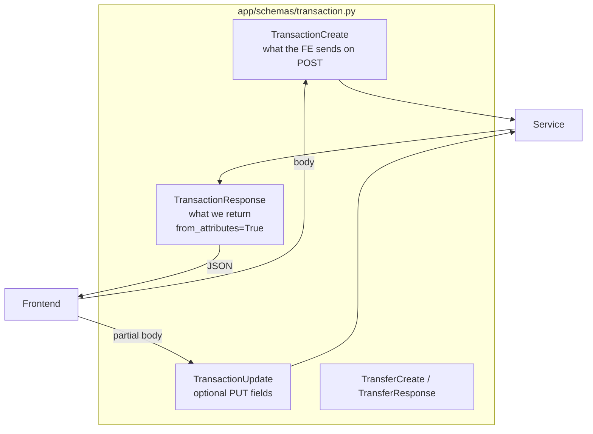

### 11.3 What `TransactionCreate` validates (step by step)

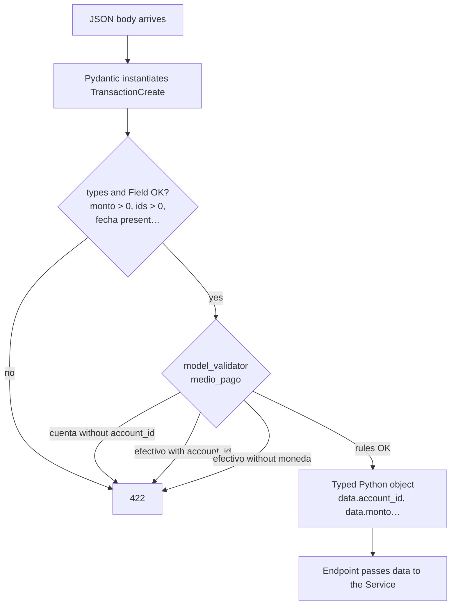

Key create fields:

```text
account_id?   category_id   sub_category_id
monto > 0     tipo: gasto|ingreso
medio_pago: cuenta|efectivo
moneda?       contraparte_id?   fecha   descripcion
```

### 11.4 Input vs output (why there are two classes)

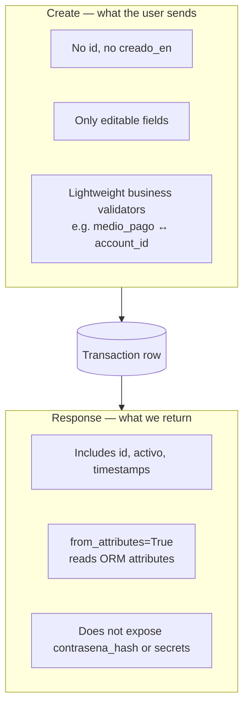

### 11.5 Mental model in one sentence

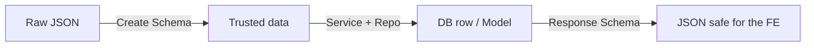

Schemas = **JSON gatekeeper**. Models = **DB rows**. They are not the same.

---

## 12. How a Model works (SQLAlchemy)

A **model** is the Python class that represents **one table** in Postgres.  
It does not validate the front's JSON (that's the schema); it describes columns, FKs, and relationships.

| Concept | What it is | Example |
|----------|--------|---------|
| **Model** | ORM class ↔ table | `Transaction` → `transactions` |
| **Schema** | HTTP JSON contract | `TransactionCreate` |
| **Alembic** | History of SQL schema changes | `alembic/versions/…` |

Real example: `app/models/transaction.py`.

### 12.1 Model ↔ table

```mermaid
flowchart LR
  Py["class Transaction(Base)<br/>app/models/transaction.py"] -->|maps| Tab[("transactions table<br/>in PostgreSQL")]
  Py -->|registered in| Meta[Base.metadata]
  Meta -->|used by Alembic| Mig[Migrations]
```

### 12.2 Anatomy of a model

```mermaid
flowchart TB
  subgraph Tx["Transaction"]
    PK[id PK autoincrement]
    FK1[account_id → accounts]
    FK2[category_id → categories]
    FK3[sub_category_id → sub_categories]
    FK4[contraparte_id → counterparties<br/>nullable]
    Cols[monto · tipo · medio_pago<br/>fecha · descripcion · activo<br/>grupo_transferencia]
    Aud[creado_en · actualizado_en]
    Rel[relationship:<br/>account, category,<br/>sub_category, counterparty]
  end

  PK --- FK1 --- FK2 --- FK3 --- FK4 --- Cols --- Aud --- Rel
```

### 12.3 Where it appears in the flow

```mermaid
flowchart LR
  EP[Endpoint] --> SCH[Create Schema]
  SCH --> SVC[Service]
  SVC --> REPO[Repository]
  REPO --> MOD[Transaction Model<br/>object in memory]
  MOD -->|INSERT/UPDATE/SELECT| DB[(PostgreSQL)]
  MOD --> RESP[Response Schema<br/>from_attributes]
  RESP --> FE[JSON to the front]
```

### 12.4 Model vs Schema relationship (same entity)

```mermaid
flowchart TB
  subgraph no_confundir["Not the same thing"]
    M["Transaction Model<br/>• SQL columns<br/>• FK / relationship<br/>• lives with the DB"]
    S["TransactionCreate/Response Schema<br/>• JSON fields<br/>• Field / validators<br/>• lives in the HTTP"]
  end

  S -->|Service builds or reads| M
  M -->|Response.model_validate| S
```

### 12.5 Life cycle of a row via Model

```mermaid
flowchart TD
  A[Service creates Transaction...] --> B[Repository.create<br/>db.add + flush]
  B --> C[(INSERT into transactions)]
  C --> D[Later: SELECT → Model object]
  D --> E{activo?}
  E -->|true| F[Appears in listings / reports]
  E -->|false soft-delete| G[Row stays in DB<br/>but is not used in active logic]
  D --> H[Response reads Model attributes]
```

### 12.6 Mental model in one sentence

```mermaid
flowchart LR
  A[Model] -->|is the| B[Python ↔ SQL row map]
  C[Schema] -->|is the| D[JSON ↔ request/response map]
  E[Alembic] -->|versions| F[column/table changes]
```

They inherit from `Base` (`app/db/base.py`). Without it, Alembic doesn't “see” the table.

---

## 13. How a Service works

A **service** is where the **business logic** lives: permissions, balances, product validations.  
It does not parse JSON (schema) or write SQL by hand (repository).

| Layer | Decides | Example |
|------|--------|---------|
| **Endpoint** | HTTP route + Depends | `create_transaction(...)` |
| **Service** | Can it be done? What effect does it have? | `TransactionService.create` |
| **Repository** | Read/write rows | `TransactionRepository.create` |

Real example: `app/services/transaction.py`.

### 13.1 Place in the architecture

```mermaid
flowchart TB
  EP[Endpoint<br/>thin] --> SVC[Service<br/>business rules]
  SVC --> REPO1[AccountRepository]
  SVC --> REPO2[CategoryRepository]
  SVC --> REPO3[TransactionRepository]
  REPO1 --> DB[(Postgres)]
  REPO2 --> DB
  REPO3 --> DB
  SVC -->|returns Model| EP
  EP -->|response_model Schema| FE[Frontend]
```

### 13.2 Typical responsibilities

```mermaid
flowchart LR
  subgraph Service["TransactionService"]
    O[Ownership<br/>is it mine?]
    R[Rules<br/>funds, medio_pago,<br/>consistent cat/sub]
    E[Effects<br/>± saldo, soft-delete,<br/>transfer pairs]
    C[Orchestrate repos<br/>+ commit]
  end

  O --> R --> E --> C
```

### 13.3 Concrete flow: `TransactionService.create`

```mermaid
flowchart TD
  A[Endpoint calls<br/>TransactionService.create] --> B[_resolve_account_for_medio<br/>own account or cash wallet]
  B --> C[_ensure_category_pair]
  C --> D[_ensure_own_active_counterparty]
  D --> E[_ensure_sufficient_funds<br/>if it is gasto]
  E -->|fails| Err[HTTPException 400/404]
  E -->|OK| F[Build Transaction object]
  F --> G[TransactionRepository.create]
  G --> H[_apply_saldo ± monto]
  H --> I[AccountRepository.update]
  I --> J[db.commit + refresh]
  J --> K[return Transaction model]
```

### 13.4 What it does and does not do

```mermaid
flowchart TB
  subgraph SI["Yes — Service"]
    S1[Validate ownership]
    S2[Reject insufficient funds]
    S3[Create cash wallet if needed]
    S4[Update balance according to tipo]
    S5[Soft-delete + revert impact]
  end

  subgraph NO["No — other layers"]
    N1[Parse JSON → Schema]
    N2[Define SQL columns → Model]
    N3[Build generic SELECT → Repository]
    N4[Choose route HTTP status → Endpoint]
  end
```

### 13.5 Service vs Repository

```mermaid
sequenceDiagram
  participant EP as Endpoint
  participant SVC as Service
  participant REPO as Repository
  participant DB as Postgres

  EP->>SVC: create(db, user, data)
  Note over SVC: The rules are here
  SVC->>REPO: get_by_id_for_user(...)
  REPO->>DB: SELECT
  DB-->>REPO: row / None
  REPO-->>SVC: Account | None
  alt not mine / inactive
    SVC-->>EP: HTTPException 404
  else OK
    SVC->>REPO: create(item)
    REPO->>DB: INSERT
    SVC->>DB: commit
    SVC-->>EP: Model
  end
```

### 13.6 Mental model in one sentence

```mermaid
flowchart LR
  A[Schema] -->|valid data| B[Service]
  B -->|business orders| C[Repository]
  C -->|SQL| D[(DB)]
  B -->|HTTPException| E[400 / 403 / 404]
```

**Service = the cook** (decides the recipe). Repository = opening the fridge. Endpoint = the service window.

---

## 14. How a Repository works

A **repository** is the layer that **talks to the DB** via SQLAlchemy: `SELECT`, `add`, `flush`.  
It knows nothing about HTTP, JWT, or Pydantic. Only `Session` + models.

| Layer | Role |
|------|-----|
| **Service** | Rules + `commit` |
| **Repository** | Queries / persistence + `flush` |
| **Model** | Row shape |

Real example: `app/repositories/transaction.py` · guide: [REPOSITORIES.md](REPOSITORIES.md).

### 14.1 Place in the architecture

```mermaid
flowchart LR
  SVC[Service] --> REPO[Repository]
  REPO --> MOD[Model]
  MOD --> DB[(PostgreSQL)]
  REPO -->|returns Model / list / None| SVC
```

### 14.2 This project's convention

```mermaid
flowchart TB
  subgraph Repo["Repository"]
    R1[db.add / changes on objects]
    R2[db.flush — gets id without closing the transaction]
  end

  subgraph Svc["Service"]
    S1[Orchestrates several repos]
    S2[db.commit — confirms everything]
    S3[db.refresh — reloads timestamps]
  end

  Repo --> Svc
```

This way an expense can do **INSERT transaction + UPDATE saldo** in **a single commit**.

### 14.3 Typical methods

```mermaid
flowchart TB
  subgraph TXR["TransactionRepository"]
    G1[get_by_id]
    G2[get_by_id_for_user<br/>ownership via join to Account]
    L[list_filtered<br/>filters + limit/offset + total]
    C[create → add + flush]
    U[update → flush]
    P[list_by_transfer_group<br/>transfer legs]
  end
```

### 14.4 Concrete flow: create a transaction

```mermaid
sequenceDiagram
  participant SVC as TransactionService
  participant AccR as AccountRepository
  participant TxR as TransactionRepository
  participant DB as Postgres

  SVC->>AccR: get_by_id_for_user / get_or_create cash
  AccR->>DB: SELECT …
  AccR-->>SVC: Account

  Note over SVC: Business validations

  SVC->>TxR: create(db, Transaction(...))
  TxR->>DB: INSERT + flush
  TxR-->>SVC: item with id

  SVC->>AccR: update saldo
  AccR->>DB: flush changes
  SVC->>DB: commit
```

### 14.5 What it does and does not do

```mermaid
flowchart TB
  subgraph SI["Yes — Repository"]
    A[Build select / where / join]
    B[Filter only_active]
    C[add + flush]
    D[Return Model or None]
  end

  subgraph NO["No — other layers"]
    E[Sufficient funds? → Service]
    F[Validate JSON → Schema]
    G[route status 401/404 → Endpoint]
    H[db.commit except rare cases → Service]
  end
```

### 14.6 Ownership: the `*_for_user` pattern

```mermaid
flowchart TD
  A[get_by_id_for_user] --> B[JOIN / user_id filter]
  B --> C{Exists and belongs to the user?}
  C -->|yes| D[return Model]
  C -->|no| E[return None]
  E --> F[Service converts None → 404]
```

The repository **does not raise** HTTPException; the service interprets `None`.

### 14.7 Mental model in one sentence

```mermaid
flowchart LR
  A[Service asks] -->|find / save| B[Repository]
  B -->|SQLAlchemy| C[(DB)]
  B -->|Model in memory| A
```

**Repository = opening the fridge** (fetch or store ingredients).  
**Service = cooking** (decide what can be done with them).

---

## 15. How the database works

In this project **Postgres only stores data**. It knows nothing about JWT or “expense vs income”.  
The table shape is defined by the **backend** (models + Alembic).

| Piece | Role |
|-------|-----|
| **Docker `db`** | Postgres container + volume (persistence) |
| **Alembic** | Creates/alters tables (`alembic upgrade head`) |
| **SQLAlchemy engine/session** | Connections from the API |
| **Models** | Python ↔ tables map |
| **Repositories** | SQL via ORM |
| **Seed SQL** | Demo data (`scripts/data/demo_100_users.sql`) |

Column detail: [MODELS.md](MODELS.md). Current Alembic head: `a7b8c9d0e1f2`.

### 15.1 Physical view

```mermaid
flowchart LR
  API[Backend FastAPI<br/>on your PC / server]
  PG[(PostgreSQL<br/>container db)]
  VOL[Docker volume<br/>data on disk]
  ALE[Alembic<br/>./scripts/migrate.sh]

  API -->|DATABASE_URL<br/>SQLAlchemy| PG
  ALE -->|CREATE/ALTER TABLE| PG
  PG --> VOL
```

`docker compose up db -d` brings up the **empty** engine. The tables appear when you migrate.

### 15.2 Domain tables (map)

```mermaid
erDiagram
  users ||--o{ accounts : has
  users ||--o{ counterparties : has
  users ||--o{ budgets : has
  users ||--o{ refresh_tokens : has
  accounts ||--o{ transactions : moves
  categories ||--o{ sub_categories : contains
  categories ||--o{ transactions : classifies
  categories ||--o{ budgets : limits
  sub_categories ||--o{ transactions : classifies
  counterparties ||--o| transactions : optional

  users {
    int id PK
    string correo
    string usuario
    string contrasena_hash
    string rol
    bool activo
  }
  accounts {
    int id PK
    int user_id FK
    string banco
    string tipo
    string moneda
    decimal saldo
    bool activo
  }
  transactions {
    int id PK
    int account_id FK
    int category_id FK
    int sub_category_id FK
    int contraparte_id FK
    decimal monto
    string tipo
    string medio_pago
    bool activo
  }
  budgets {
    int id PK
    int user_id FK
    int category_id FK
    decimal limite
    bool activo
  }
```

There are also `categories`, `sub_categories`, `counterparties`, `refresh_tokens`.

### 15.3 Session-per-request cycle

```mermaid
sequenceDiagram
  participant EP as Endpoint
  participant Dep as get_db deps.py
  participant Eng as engine / SessionLocal
  participant PG as PostgreSQL

  EP->>Dep: Depends(get_db)
  Dep->>Eng: SessionLocal()
  Eng->>PG: open connection from the pool
  Dep-->>EP: db Session
  Note over EP: Service + Repository use db
  EP->>PG: SELECT / INSERT / UPDATE
  Note over EP: Service commits if all OK
  EP->>Dep: end of request
  Dep->>Eng: db.close()
```

File: `app/db/session.py` (`pool_pre_ping=True`, `autocommit=False`).

### 15.4 Who creates the schema

```mermaid
flowchart TD
  M[You write app/models/Foo.py] --> I[Import in models/__init__.py]
  I --> R[alembic revision --autogenerate]
  R --> V[File in alembic/versions/]
  V --> U[alembic upgrade head<br/>or ./scripts/migrate.sh]
  U --> T[(Tables/columns in Postgres)]
```

The API does **not** do `create_all` in production: the contract is Alembic.

### 15.5 Accounting rules in the DB (effect, not magic)

```mermaid
flowchart LR
  subgraph BD["What the DB stores"]
    Acc[accounts.saldo]
    Tx[transactions rows]
  end

  subgraph App["What the API decides"]
    Svc[TransactionService]
  end

  Svc -->|INSERT transaction| Tx
  Svc -->|UPDATE saldo ± monto| Acc
  Svc -->|DELETE HTTP = activo=false<br/>+ revert saldo| Tx
  Svc -->|UPDATE| Acc
```

Postgres does **not** recompute balances on its own: the service does it in the same SQLAlchemy transaction (single `commit`).

### 15.6 Demo data

```mermaid
flowchart LR
  Mig[migrate → empty tables] --> Seed[psql -f demo_100_users.sql]
  Seed --> Users[demo001…demo100]
  Users --> Accs[accounts + cash]
  Accs --> Movs[2026 transactions]
```

### 15.7 Mental model in one sentence

```mermaid
flowchart LR
  A[Postgres] -->|is| B[row store]
  C[Alembic] -->|defines| D[table shape]
  E[Models + Repos] -->|read and write| A
  F[Services] -->|rules over that data| E
```

**DB = fridge.** Alembic = shelf blueprints. API = who cooks with what's stored.

---

## 16. HTTP vs HTTPS (reverse proxy)

The uvicorn API speaks **internal HTTP**. In production the **proxy** terminates TLS.

```mermaid
flowchart LR
  U[User / Frontend] -->|HTTPS :443<br/>TLS certificate| P[Reverse proxy<br/>Caddy / Nginx / Traefik / ALB]
  P -->|HTTP :8000<br/>X-Forwarded-Proto=https| API[FastAPI / uvicorn]
  API --> PG[(Postgres)]
```

### Production with `FORCE_HTTPS`

```mermaid
flowchart TD
  R[Request reaches FastAPI] --> A{APP_ENV=production<br/>and FORCE_HTTPS?}
  A -->|no| OK[Continues normally<br/>local HTTP OK]
  A -->|yes| B{X-Forwarded-Proto<br/>== https?}
  B -->|no| E400[400 HTTPS required]
  B -->|yes| C[Process request]
  C --> D[Response + HSTS header]
```

Local: `http://localhost:8000` + `FORCE_HTTPS=false`.  
Prod: HTTPS proxy + `FORCE_HTTPS=true` + `APP_ENV=production`. See [SECURITY.md](SECURITY.md).

---

## 17. Local startup (day 1)

```mermaid
flowchart TD
  A[Clone repo + .venv + pip install] --> B[cp .env.example .env]
  B --> C[docker compose up db -d]
  C --> D[./scripts/migrate.sh<br/>alembic upgrade head]
  D --> E{Do you want demo data?}
  E -->|yes| F[psql … -f scripts/data/demo_100_users.sql]
  E -->|no| G[uvicorn app.main:app --reload]
  F --> G
  G --> H[API on :8000<br/>/docs if DEBUG=true]
  H --> I[Login demo001 / Password123!]
```

```mermaid
flowchart LR
  subgraph host["Your PC"]
    UV[uvicorn FastAPI]
    SCR[scripts migrate / seed]
  end
  subgraph docker["Docker"]
    DB[(Postgres + volume)]
  end
  UV --> DB
  SCR --> DB
```

---

## 18. Budgets (`/budgets`)

Single **monthly** limit per `(user, category)`. Migration `a7b8c9d0e1f2`.

```mermaid
flowchart TD
  A[POST /budgets<br/>category_id + limite] --> B{Does a budget<br/>already exist for that category?}
  B -->|active| E409[409 conflict]
  B -->|inactive| C[Reactivate + update limit]
  B -->|no| D[INSERT budgets]
  C --> OK[Budget]
  D --> OK
```

### Month's consumption

```mermaid
flowchart LR
  B[Active budget] --> S[BudgetService.to_status / list_status]
  S --> G[Sum active expenses<br/>of that category<br/>in the calendar month]
  G --> ST[BudgetStatus:<br/>gastado, restante,<br/>pct_usado, excedido]
  ST --> R[Also in<br/>GET /reports/summary<br/>→ budgets_status]
```

CRUD: `GET/POST/PUT/DELETE /budgets` + `GET /budgets/status` + reactivate.

---

## 19. Reports / dashboard (`GET /reports/summary`)

```mermaid
flowchart TD
  A[GET /reports/summary<br/>JWT + optional filters] --> B[ReportService.summary]
  B --> C[Only transactions activo=true]
  C --> D[Operational totals<br/>income / expenses / net]
  C --> E[Transfers separate]
  C --> F[by_category / by_subcategory]
  C --> G[by_medio_pago]
  C --> H[by_counterparty top 10]
  C --> I[by_month / by_account]
  B --> J[period_comparison<br/>current vs previous window]
  B --> K[BudgetService.list_status]
  D --> Z[ReportSummary JSON]
  E --> Z
  F --> Z
  G --> Z
  H --> Z
  I --> Z
  J --> Z
  K --> Z
```

Filters: `date_from`, `date_to`, `account_id`.  
Transfers do **not** inflate day-to-day expenses/income.

---

## 20. Cash / automatic wallet

```mermaid
flowchart TD
  A[POST /transactions<br/>medio_pago=efectivo] --> B[currency required<br/>no account_id]
  B --> C[AccountRepository.get_or_create_cash_wallet]
  C --> D{Does an account exist<br/>user + currency<br/>tipo=efectivo?}
  D -->|yes| E[Use that account]
  D -->|no| F[Create<br/>banco=Efectivo<br/>tipo=efectivo]
  E --> G[INSERT transaction<br/>account_id = wallet]
  F --> G
  G --> H[± wallet balance]
```

```mermaid
flowchart LR
  Banco[Bank account<br/>tipo savings/checking] <-->|POST /transfers| Cash[Cash wallet<br/>tipo=efectivo]
```

`POST /accounts` with `tipo=efectivo` by hand → **400** (auto only).

---

## 21. Admin + TOTP MFA

```mermaid
sequenceDiagram
  actor A as Admin
  participant L as POST /auth/login
  participant M as POST /auth/mfa/verify
  participant API as Admin catalog routes

  A->>L: username + password
  alt password OK and mfa_enabled
    L-->>A: mfa_required + mfa_token<br/>(no access/refresh yet)
    A->>M: mfa_token + TOTP app code
    M-->>A: access_token + refresh_token
  else regular user
    L-->>A: tokens directly
  end
  A->>API: Bearer access + rol=admin + active MFA
  Note over API: get_current_admin requires both
```

MFA setup (creating the TOTP secret) lives in endpoints/auth MFA enable; the admin login **always** goes through the challenge if `mfa_enabled=true`.

---

## 22. HMAC webhooks (`POST /webhooks/inbound`)

Does not use JWT. Validates the body's integrity. Does **not** call payload URLs (anti-SSRF).

```mermaid
flowchart TD
  Ext[External system] --> Sig["Signature:<br/>t=timestamp,v1=HMAC_SHA256<br/>of ts. + raw_body"]
  Sig --> EP[POST /webhooks/inbound<br/>header X-Webhook-Signature]
  EP --> V{verify_signature}
  V -->|no WEBHOOK_SECRET| E503[503]
  V -->|bad / old >300s| E401[401]
  V -->|OK| P[Validate Pydantic JSON]
  P --> R[202 received<br/>process internal event]
```

```mermaid
flowchart LR
  Body[raw body bytes] --> Msg["ts. + body"]
  Msg --> H[HMAC-SHA256<br/>WEBHOOK_SECRET]
  H --> Header[t=…,v1=hex]
```

---

## 23. Test pyramid

```mermaid
flowchart TB
  subgraph muchos["Many — cheap"]
    U[unit<br/>services / repos / core<br/>in-memory SQLite]
  end
  subgraph algunos["Some"]
    I[integration<br/>TestClient API<br/>integration marker]
  end
  subgraph pocos["Few — expensive"]
    P[postgres<br/>RUN_INTEGRATION=1]
    E[e2e<br/>live server RUN_E2E=1]
  end
  U --> I --> P
  I --> E
```

```bash
pytest -m "not e2e and not postgres"   # day to day
pytest -m postgres                      # with real Postgres
```

See [TESTING.md](TESTING.md).

---

## 24. CI (GitHub Actions)

Workflow: `.github/workflows/ci.yml`  
Triggers: push to `main`/`dev`/`dev_*` and PRs to `main`/`dev`.

```mermaid
flowchart TD
  A[push / pull_request] --> B[Checkout + Python 3.12]
  B --> C[pip install requirements-dev]
  C --> D[Ruff lint]
  C --> E[pip-audit]
  C --> F[Postgres 16 service]
  F --> G[alembic upgrade head]
  G --> H["pytest not e2e and not postgres<br/>+ coverage ≥ 70%"]
  G --> I[pytest -m postgres<br/>RUN_INTEGRATION=1]
  D --> J{OK?}
  E --> J
  H --> J
  I --> J
  J -->|yes| Green[CI green]
  J -->|no| Red[CI red · blocks merge]
```

---

## How to use these diagrams

1. Open [https://mermaid.live](https://mermaid.live)
2. Paste only the content between ` ```mermaid ` and ` ``` `
3. Export PNG/SVG if you need it for Notion/Figma/slides
4. In **diagrams.net**: *Arrange → Insert → Advanced → Mermaid* also accepts similar syntax
